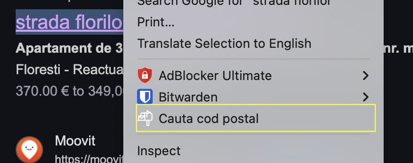
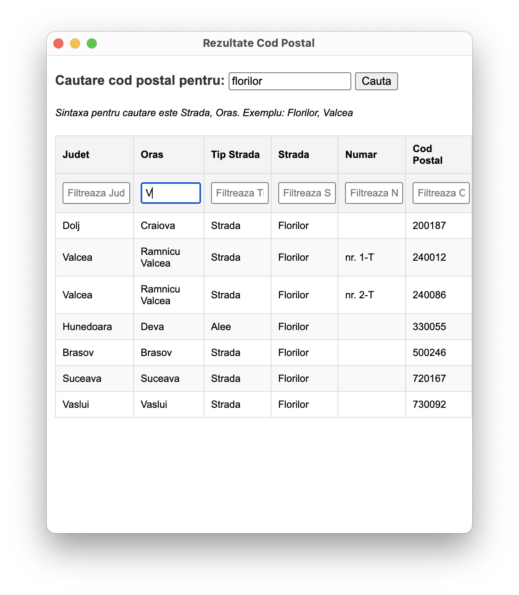

# Caută Cod Poștal

Caută Cod Poștal is a Chrome extension that allows users to search for postal codes directly from a webpage or through a popup interface. The extension integrates with [oapi.ro](https://oapi.ro) to provide accurate and fast postal code lookups.

## Features

- **Context Menu Integration**: Search for postal codes by selecting text on a webpage and using the context menu.
- **Popup Interface**: Perform postal code searches directly from the extension's popup window.
- **Filtering and Sorting**: Filter and sort search results by county, city, street type, street name, number, or postal code.
- **Optimized Popup Positioning**: Automatically centers the popup window on the primary display for better usability.

## Permissions Justification

- **`contextMenus`**: Enables the context menu for searching postal codes from selected text.
- **`activeTab`**: Allows interaction with the currently active tab when initiating a search.
- **`system.display`**: Retrieves display information to position the popup window optimally.
- **`host_permissions`**: Grants access to `*://oapi.ro/coduri-postale/*` for fetching postal code data.

## Installation

1. Clone the repository:
   ```bash
   git clone https://github.com/baad777/cauta-cod-postal.git
   ```
2. Open Chrome and navigate to `chrome://extensions/`.
3. Enable "Developer mode" in the top right corner.

## Usage

Select text on a webpage (e.g., an address). and right click

### Context Menu

</img>

### Popup Interface

</img>

Search query for api is `{streetQuery}, {cityQuery}`

Example: `Unirii, Bucuresti`

## File structure

- `icons/` - Contains icons for the extension.
- `img/` - Contains images for the README and other documentation.
- `manifest.json` - The manifest file for the Chrome extension.
- `popup.html` - The HTML file for the popup interface.
- `popup.js` - The JavaScript file for the popup interface.
- `popup.css` - The CSS file for styling the popup interface.
- `background.js` - The background script for handling context menu actions.
- `content.js` - The content script for interacting with the webpage.

## License

This project is licensed under the MIT License.